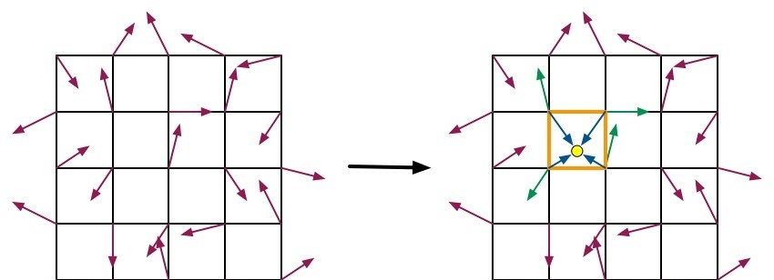
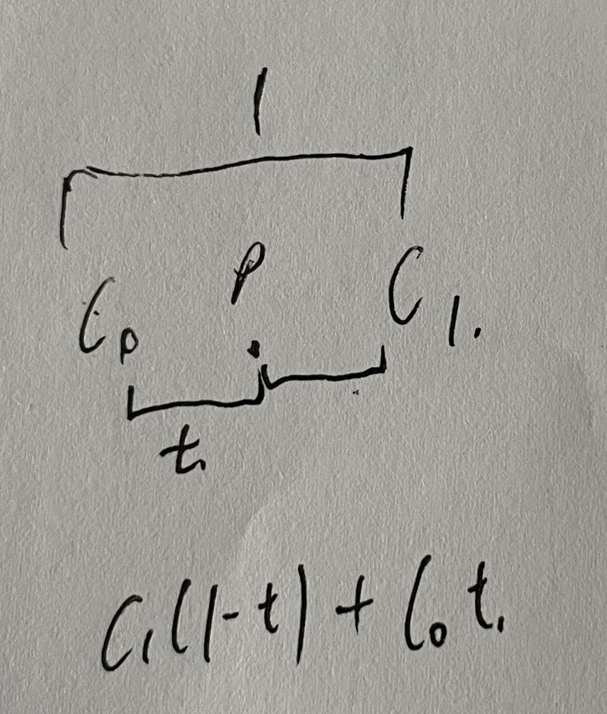
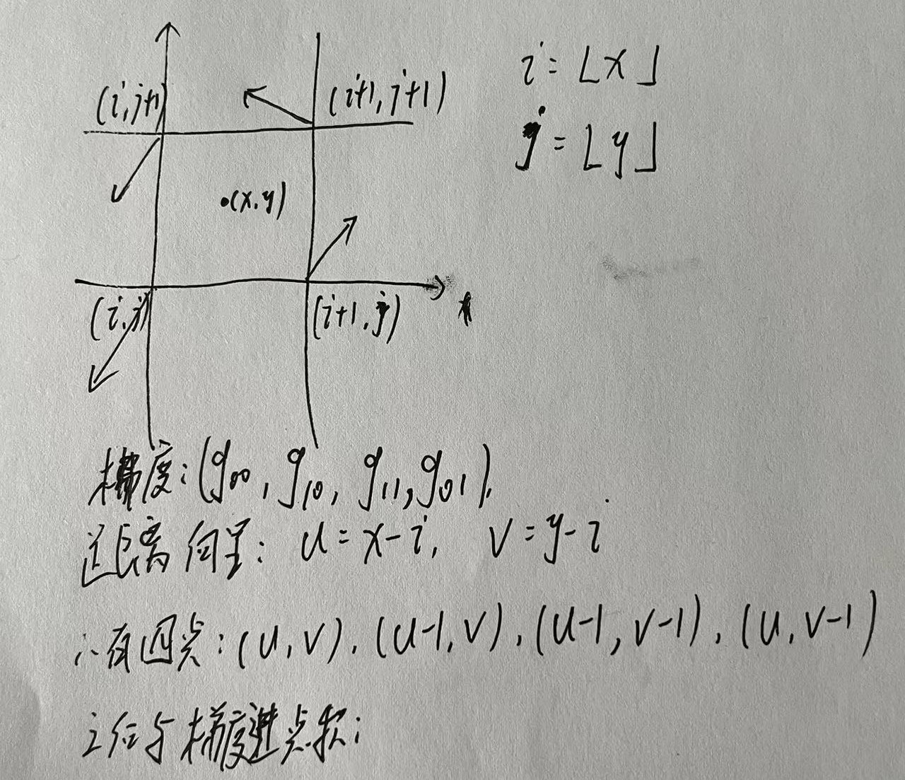
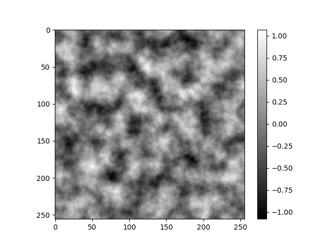
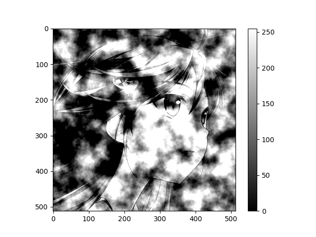
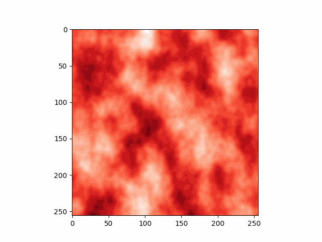

## perlin基本信息
Perlin噪声（Perlin noise，又称为柏林噪声）指由Ken Perlin发明的**自然噪声生成算法**，具有在函数上的连续性，并可在多次调用时给出一致的数值。 在电子游戏领域中可以透过使用Perlin噪声生成具连续性的地形；或是在艺术领域中使用Perlin噪声生成图样。

由于一些历史原因，Simplex噪声和分形噪声（texture synthesis）都曾在学术论文中被单独称作Perlin噪声。

## 经典Perlin噪声
perline噪声是基于晶格的方法。它属于梯度噪声，其原理就是将坐标系划分成一块一块的晶格，之后在晶格的顶点出生成一个随机梯度，通过与晶格顶点到晶格内点的向量进行点乘加权计算后得到噪声。

### 实现perlin噪声的过程需要插值
* 对于一维：插值使用的是一个在0处为1，在1处为0，在0.5处为0.5的连续单调递减函数。例如对，设$c_{0}$,$c_{1}$为左右两个整数点的数值，t为该点距离左边点的距离，使用$(1-t)$作为插值函数，则该点的值为$c_{1}(1-t)+c_{0}t$。

但是$(1-t)$是线性插值，人工痕迹比较严重，并且在整数点上不连续。Perlin建议使用$3t^{2}-2t^{3}$作为插值函数。后来建议使用$6t^{5}-15t^{4}+10t^{3}$作为插值函数。事实上，只有在区间[0,1]内的连续函数$f$，有$f(0)=1,f(1)=0$且$f^{`}(0)=f^{`}(1)=0$的函数皆可作为插值函数。
* 对于二维：对于点$(x,y)$，令$i=\lfloor x \rfloor,j=\lfloor y \rfloor$，它所在的晶格的四个顶点分别为$(i,j)、(i+1,j)、(i+1,j+1)、(i,j+1)$。令$u=x-i,v=y-j$，这四个顶点对点$(x,y)$的贡献可以使用它们的梯度$(g_{00},g_{10},g_{11},g_{01})$和$(x,y)$点与这四个顶点的方向$((u,v),(u-1,v),(u-1,v-1),(u,v-1))$进行点积获得。但是在二维的情况下，插值更为复杂。首先需要对 $(i,j)$ 和$(i+1,j)$ 两点在$x$方向插值，得到点$(x,j)$的值；之后对$(i,j+1)$ 和 $(i+1,j+1)$两点在$x$方向插值，得到点$(x,j+1)$的值；最后对$(x,j)$和$(x,j+1)$ 在$y$方向插值，得到$(x, y)$的值。

## 结果
* Perlin 2D噪声 
* 给人物图像添加perlin噪声
<!-- <table><tr>
<td></td>
<td></td>
</tr></table> -->

* 3D perline噪声

